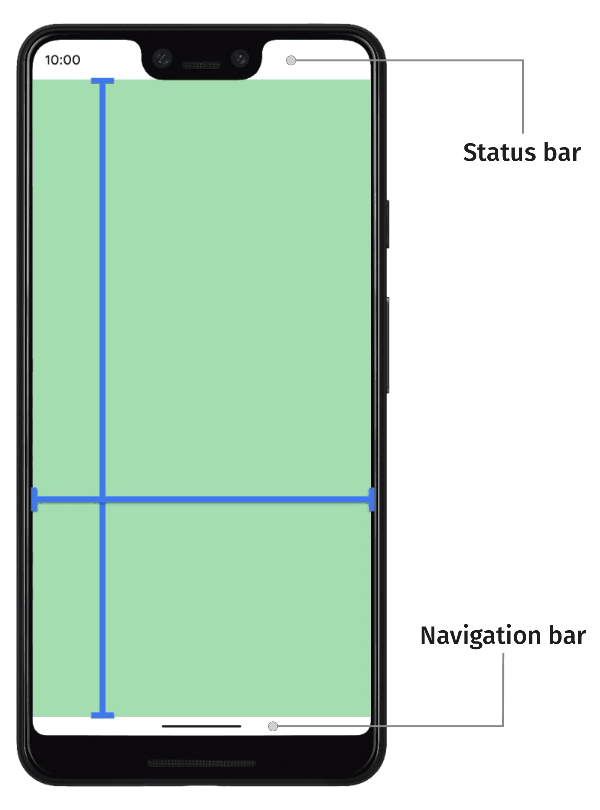
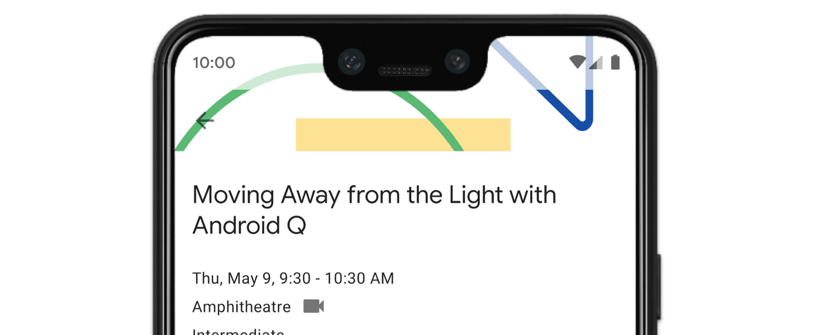
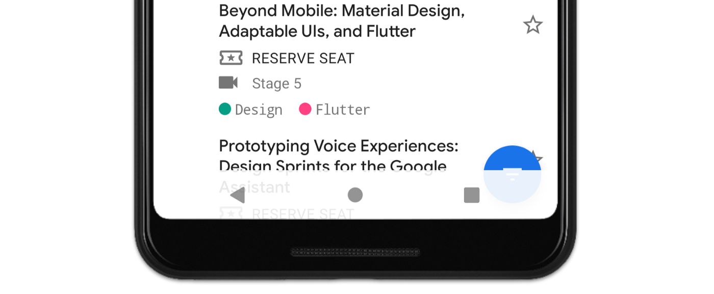
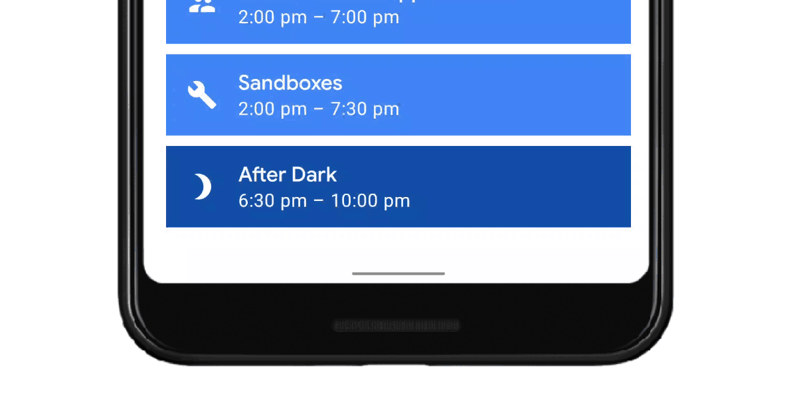
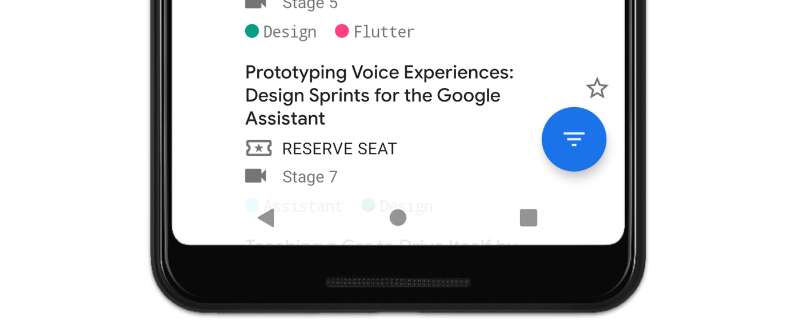
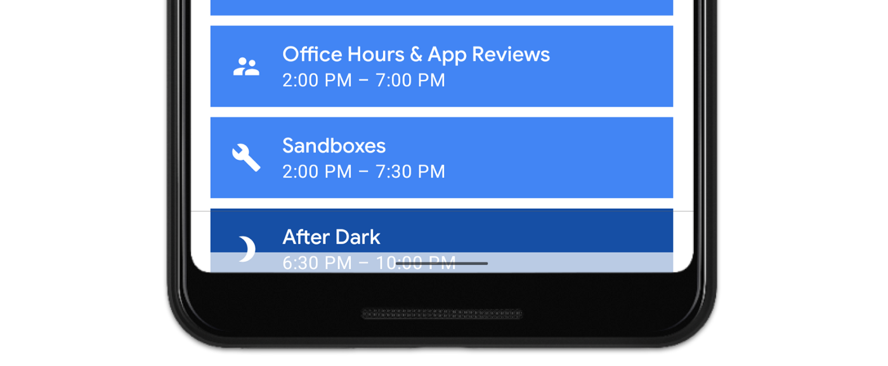
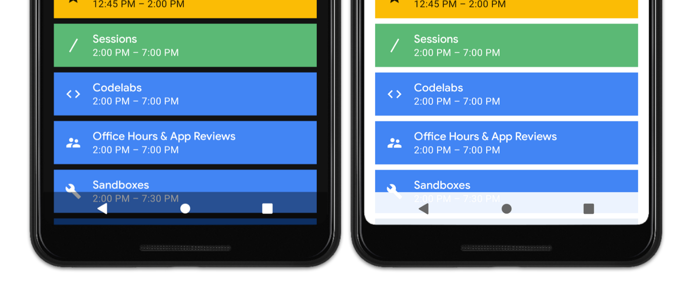

# 手势导航：实现全屏（一）

译自：[手势导航：实现全屏（一）](https://medium.com/androiddevelopers/gesture-navigation-going-edge-to-edge-812f62e4e83e)

这是我们手势导航系列的第一篇博客。如果你想直接跳转到其他博客，你可以直接点击下面的链接：

- [手势导航：处理视觉重叠（二）](https://medium.com/androiddevelopers/gesture-navigation-handling-visual-overlaps-4aed565c134c)
- [手势导航：处理手势冲突（三）]()
- [手势导航：沉浸模式（四）]()

安卓10增加了一种新的系统导航方式。这种方式允许用户通过手势返回、回到home页或触发设备助手。


使用手势作为系统导航方式时，应用可以获得更多的显示区域。这使得应用可以为用户提供更加沉浸式的体验。

在大多数设备上，用户都可以选择导航方式。当前的三键导航方式（back、home和recents）会继续保留。这时所有安卓10之后的设备都需要满足的。

你可以在以下这篇安卓SystemUI产品经理发布的博客中，了解到更多关于手势导航的研究和决策。

[手势导航的背景故事](https://android-developers.googleblog.com/2019/08/gesture-navigation-backstory.html)

这篇文章是手势导航系列的第一篇。这一系列旨在告诉开发者如何使应用支持手势导航，这一系列包含以下主题：

1. 实现全屏，使你的应用可以在整个屏幕上显示；
2. 处理和SystemUI的视觉重叠；
3. 处理和系统手势的手势冲突；
4. 如何支持一些通用场景。

让我们从如何实现全屏开始：



我们使用“全屏”（edge-to-edge）一词来表示应用可以在整个屏幕上显示。一般来说，应用显示在状态栏（status bar）之下，导航栏（navigation bar）之上。状态栏和导航栏统称为系统栏（system bars）。

全屏显示时，应用会在系统栏后面显示出来，以获得更加沉浸式的体验。

事实上，这意味着应用需要考虑两件事：

**在导航栏后面绘制**

首先，对于手势导航的支持需要考虑的最重要的一件事，是在导航栏后面绘制。因为导航栏在大小和突出程度上都缩小了，所以为了获得更加引人注目和现代化的UX效果，强烈推荐应用在安卓10以后的设备上运行时，在导航栏后面绘制。

在安卓P以下的设备中，导航栏后绘制时可选的，由app来决定是否需要这么做。也就是说，几乎所有必要的API都会兼容API 21（或者由AndroidX来处理差异），所以支持API 29之前的设备所需的工作量是很少的。API 29以前设备的用户也会受益于更加沉浸式的体验。我们认为它可选只是为了最小化所需的修改和测试的工作量。

**在状态栏后绘制**

其次，我们看向屏幕顶端的状态栏。如果对于你的应用的内容显示有帮助，也推荐在状态栏后面绘制。这是什么意思呢？显示宽度等于屏幕宽度的图片就是一个合适在状态栏后绘制的例子。对于开发者来说，这就相当于你将AppBarLayout之类的组件显示在屏幕顶部。



另一方面，如果你的UI由一系列条目组成，并且在顶部固定区域有一个工具栏，在状态栏之后显示可能就没有意义。导航栏上有相同的规则：安卓10以前的设备都是可选的。

**实现**

全屏绘制有三个关键步骤。

**1. 请求全屏显示**

第一步是要告诉系统将我们的app在系统栏后显示。我们需要在窗口上使用接口：*setDecorFitsSystemWindows()*。

```java
WindowCompat.setDecorFitsSystemWindows(window, false)
```

执行了这个之后，我们的控件就会显示在导航栏的后面。



**2. 改变系统栏颜色**

我们已经全屏显示了，现在我们需要改变系统栏的颜色，这样我们才能看到后面的内容。

**安卓10**

在安卓10上，我们唯一的任务就是将系统栏设置为全透明。

```xml
<!-- values-v29/themes.xml -->
<style name="Theme.MyApp">
    <item name="android:navigationBarColor">
        @android:color/transparent
    </item>

    <!-- Optional, if drawing behind the status bar too -->
    <item name="android:statusBarColor">
        @android:color/transparent
    </item>
</style>
```

在安卓10的所有导航方式上，系统会负责处理导航栏的所有视觉保护，包括提示条、按钮等。这表示我们不用再自己实现它。系统在这里做了两件事：

**动态颜色调整**

系统栏会基于它的背景改变颜色。如果提示条显示在亮色的内容上，它就会变为暗色。相反，如果背景是暗色，提示条就会变为亮色。我们称这为动态颜色调整。



**半透明纱幕**

或者，系统会给系统栏添加一个半透明的纱幕。当且仅当你的app声明targetSdkVersion为29时，才会生效。如果你的app的目标sdk为28或者更低，自动纱幕不会生效，此时导航栏是透明的。



所有这些行为确保我们总是可以看到系统栏的内容。系统选择使用哪个取决于几个因素，纱幕不会使用，仅当：

- 当前导航方式为按键导航（两键或三键）
- 在手势导航的情况下，设备商禁用了动态颜色调整。可能警用的原因是设备没有足以处理颜色调整的性能。



否则，就将使用动态颜色调整。以下为我们仍旧使用，但是未来会改变的内容。

**在安卓10上禁用系统栏保护**

如果你不希望系统执行任何自动内容保护，你可以通过设置android:enforceNavigationBarContrast和android:enforceStatusBarContrast为false，来禁用他们。

**安卓P及以下**

如果你希望在安卓Q以前的设备上实现全屏，你需要通过给系统栏设置一个半透明的颜色，来模拟内容保护。可以用一个有70%透明度的黑色纱幕来替代暗色系统栏的主题：

```xml
<!-- values/themes.xml -->
<style name="Theme.MyApp">
    <item name="android:navigationBarColor">
        #B3FFFFFF
    </item>
</style>

<!-- values-night/themes.xml -->
<style name="Theme.MyApp">
    <item name="android:navigationBarColor">
        #B3000000
    </item>
</style>
```

你可能需要根据背景内容，调整透明度。例如对于亮色的主题，你也需要设置一个半透明的亮色（例如#B3FFFFFF）。



**3. 视觉重叠**

在完成了这些之后，你可能会注意到，你的一些重要的控件显示在系统栏的后面了。我们最后一步就是处理这些视觉重叠，这些我们会在下一篇博客讲到。

[手势导航：处理视觉重叠（二）](https://medium.com/androiddevelopers/gesture-navigation-handling-visual-overlaps-4aed565c134c)